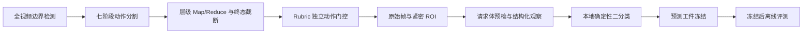

# Resistance Video Action Gating

伏安法测电阻实验视频的七阶段动作分割、Rubric 独立视觉取证和纸面记录/仪表读数一致性核验原型。

该项目把“什么时候发生了什么动作”和“某个评分项是否有直接视觉证据”分开处理。七阶段分割只提供检索时间窗，不能直接充当评分证据。评分层最终只输出 `pass` 或 `fail`；置信度、可见性和候选帧只作为诊断信息。

> 这是研究原型，不是可直接投入教学评分的完整产品。仓库不包含真实学生视频、姓名、Excel 标注、专家分数、原始模型响应或历史实验输出。

## 核心流程



七个动作阶段：

| 标识 | 含义 |
|---|---|
| `circuit_wiring` | 电路连接 |
| `measurement_1` | 第一次测量 |
| `recording_1` | 记录第一组数据 |
| `circuit_rewiring` | 电路改接 |
| `measurement_2` | 第二次测量 |
| `recording_2` | 记录第二组数据 |
| `material_cleanup` | 拆除与整理 |

## 算法文件清单

| 用途 | 入口或核心文件 |
|---|---|
| 推荐七阶段动作分割 | `scripts/qwen_experiment_action_hierarchical_v2.py` |
| 七阶段契约、提示词与 Reduce | `scripts/qwen_hierarchical_v1_contract.py`、`scripts/qwen_hierarchical_v1_prompts.py`、`scripts/qwen_hierarchical_v1_reduce.py` |
| 实验性七阶段 v3 | `scripts/qwen_experiment_action_hierarchical_v3.py`、`scripts/qwen_hierarchical_v3_*.py` |
| 任意新视频本地一键编排 | `scripts/run_resistance_pipeline.py` |
| 从七阶段自动生成接线配置与稳定帧 | `scripts/generate_wiring_sequence_config.py` |
| 评价 8 断开换电池组 | `scripts/run_resistance_disconnect_battery_sequence_v1.py` |
| 评价 8 本地确定性 reducer | `scripts/resistance_disconnect_battery_sequence_core.py` |
| 纸面记录与仪表读数核验 | `scripts/run_meter_record_consistency_v1.py` |

## 十项评分链

`scripts/run_all_rubrics_v2.py` 是十项评分的公开编排入口。它读取动作分割结果与各项专用证据工件，并把最终评分统一为 `pass` 或 `fail`；它不读取 Excel 标签，也不修改原始视频。

| 指标 | 评分项 | 主要证据来源 |
|---:|---|---|
| 0 | 拆除整理归位 | `material_cleanup` 与整理动作证据 |
| 1 | 电流表串联 | 接线 episode 或电流表-电源短路专用证据 |
| 2 | 电压表并联 | 记录期同帧电压表/电阻端点证据 |
| 3 | 接线时开关断开 | 接线动作与刀闸状态的时间重叠证据 |
| 4 | 电表正负接线柱正确 | 测量/记录期端子、指针和读数符号证据 |
| 5 | 指针正常偏转 | 双表表盘 ROI 与连续帧指针状态 |
| 6 | 电表量程合适 | 量程端子、档位和读数证据 |
| 7 | 正确记录第一组数据 | 第一组纸面 U/I 与仪表读数核验 |
| 8 | 换电池前先断开开关 | `T0-T2 -> T0-T1/T1-T2` 与开关时序 |
| 9 | 正确记录第二组数据 | 第二轮测量语境、仪表读数和纸面 U/I |

先运行各评分项的证据提取器，将其输出路径填入匿名配置，再运行总评：

```powershell
python scripts/run_all_rubrics_v2.py `
  --action-summary outputs/qwen_experiment_action_hierarchical_v2/<run-id>/summary.json `
  --artifact-config configs/ten_rubrics_artifacts.example.json `
  --output-root outputs/all_rubrics_v2
```

配置中的未提供项不会被虚构为通过；逐视频 `result.json` 会记录每一项的来源、证据时间窗、置信度和二分类映射。

例如，指针类证据应在 `measurement_1/2` 搜索；记录纸证据应在 `recording_1/2` 搜索；整理动作应在 `material_cleanup` 或受控末段扫描中搜索。动作标签本身不证明任何 Rubric 通过或失败。

## 环境

- Python 3.10+
- OpenCV
- NumPy
- OpenAI-compatible Python client

```powershell
python -m venv .venv
.\.venv\Scripts\Activate.ps1
python -m pip install -r requirements.txt
```

模型连接信息只从环境变量读取。代码没有默认服务地址：

```powershell
$env:QWEN_API_BASE_URL = "<your-openai-compatible-base-url>"
$env:QWEN_API_TOKEN = "<your-token>"
$env:QWEN_MODEL = "<your-model-name>"
```

不要把真实值写入 `.env.example` 或提交到 Git。

## 新视频一键入口

视频仍只保存在本机的 `data/videos/`，不上传到 GitHub。下面一条命令会自动发现该目录中的任意 `.mp4`、`.mov`、`.avi`、`.mkv` 或 `.webm` 文件，并依次运行橙红色仪器扫描、实验起止判断、七阶段 v2 分割和接线配置生成：

```powershell
python scripts/run_resistance_pipeline.py `
  --video-dir data/videos `
  --output-root outputs/resistance_pipeline
```

默认动作分割仍使用稳定版 v2。要试验新版 v3，显式增加：

```powershell
python scripts/run_resistance_pipeline.py `
  --video-dir data/videos `
  --output-root outputs/resistance_pipeline `
  --action-version v3
```

先检查命令计划而不打开视频、不调用 Qwen：

```powershell
python scripts/run_resistance_pipeline.py `
  --video-dir data/videos `
  --output-root outputs/resistance_pipeline `
  --run-id check_new_videos `
  --dry-run
```

每次运行使用独立目录，并生成：

```text
outputs/resistance_pipeline/<run-id>/
├── marker_filter/
├── experiment_boundary/
├── actions/v2/
├── wiring_stable_frames/
├── generated_configs/wiring_sequence.json
└── run_report.json
```

`wiring_sequence.json` 不含历史五视频的固定时间。生成器会为每个 `circuit_wiring` / `circuit_rewiring` 建立独立 episode，在其后的测量或记录阶段重新抽帧，并依据清晰度、曝光和相邻帧静止程度选择 `stable_primary` 与 `stable_backup`。也可以单独运行：

```powershell
python scripts/generate_wiring_sequence_config.py `
  --action-summary outputs/resistance_pipeline/<run-id>/actions/v2/summary.json `
  --video-root data/videos `
  --output outputs/resistance_pipeline/<run-id>/generated_configs/wiring_sequence.json `
  --evidence-root outputs/resistance_pipeline/<run-id>/wiring_stable_frames `
  --wiring-output-root outputs/resistance_pipeline/<run-id>/wiring_results
```

当前一键入口完成到“七阶段分割 + 接线 episode/稳定帧配置”。评价 1、2、3、4、5、6、7、9 的专项视觉工件仍须由对应取证器生成，`run_report.json` 会明确列出这些项；在专项工件缺失时，不把十项汇总结果宣传为完整自动评分。评价 8 已有独立通用入口。

## 快速开始

将获得授权且已匿名化的视频放在本地 `data/videos/`。该目录被 Git 忽略。

### 1. 建立全视频时间清单

```powershell
python scripts/filter_redundant_video_frames.py `
  data/videos/sample_001.mp4 `
  --output-dir outputs/marker_filter
```

### 2. 锁定有效实验边界

```powershell
python scripts/qwen_experiment_segment_judge.py `
  --input-dir outputs/marker_filter `
  --output-dir outputs/experiment_boundary `
  --prompt-profile voltmeter_resistance `
  --timestamp-watermark
```

模型只选择匿名帧 ID；时间戳由本地代码映射。请求失败时脚本保存脱敏错误并返回非零退出码。

### 3. 执行推荐的七阶段动作分割 v2

v2 使用重叠时间窗 Map、全局 Reduce、本地单调状态机和边界复核。默认启用 `local_partial` 恢复：局部冲突只隔离冲突事件；首个可信完成态整理会锁定实验终点，后续动作写入 `ignored_noise_events`。

```powershell
python scripts/qwen_experiment_action_hierarchical_v2.py `
  --segment-source outputs/experiment_boundary/summary.json `
  --schema configs/action_schemas/resistance_7stage_no_battery_v2.json `
  --output-root outputs/qwen_experiment_action_hierarchical_v2
```

`qwen_experiment_action_minute.py`、`qwen_experiment_action_minute_merge.py`、`qwen_experiment_action_segment.py` 和 `qwen_experiment_action_stepwise.py` 保留为经典对照与替换实现。

### 3.1 试验七阶段动作分割 v3

v3 是独立实验版，不覆盖 v1/v2 的代码、Schema 或输出目录。它保留相同七阶段主输出，新增以下机制：

1. Map 可输出 `auxiliary_action`，将电池配置变化、换座位、闲聊、教师介入和离题行为保留为诊断，不强行塞进七阶段。
2. TCS 对整个锁定区间只做一次 0.5 秒低清预扫描；每个窗口按 P20/P90 归一化运动分数，在时间桶之间轮询选峰，并把额外预算按 60% 高运动、40% 低运动分配，同时保留固定 5 秒锚点。
3. 每个 Map 窗口增加一次独立测量二分类。它优先检查 5 秒锚点和低运动帧，补充容易被高运动选帧漏掉的静止观察、读表和开关操作；`yes/no` 都必须引用证据帧并解释。本实验不存在滑动变阻器，提示词禁止补造调节滑片。
4. 视频最后 45 秒增加一次独立整理二分类，每 2 秒取帧。确认完成态后生成标准 `cleanup_action` 候选；即使 Reduce 的文本结果遗漏该候选，程序也会先晋升为待复核终态，再发送整理前、中、后多帧确认，未通过时恢复后续事件。
5. Reduce 后使用带权有向图 beam 解码。第一次测量后的短促接线可留在第一次循环；明确改接、新拓扑或电池配置变化会提高第二轮路径得分。
6. 严格状态路径要求先观察到 `measurement_2` 才进入 `recording_2`。若出现“重新连线后直接书写”且缺少第二次测量事件，程序按每个视频自身的事件序列建立测量桥接区间：每轮从第一个 `circuit_rewiring` 事件结束时开始，到该轮首次待定书写开始时结束；后续新一轮重新连线会自动建立新候选。候选区间由 Qwen 独立二分类复核，不读取姓名、视频 ID 或预设秒数。
7. 桥接复核观察到闭合开关、读表或测量过程时，程序补建标准 `measurement_action`；复核为 `no` 或返回无效时，使用经典版“重新连线后书写”规则恢复 `recording_2`，同时写入 `legacy_recording_2_fallback=true`、`inferred_stage=true`、`measurement_2_observed=false` 和 `fallback_source=legacy_v2_sequence_rule`，不把流程推断伪装成直接视觉观察。
8. 状态图允许 `recording_2 -> measurement_2 -> recording_2` 的局部回退，但对回退施加 `-0.2` 惩罚并在事件中保存转移原因。两轮测量后集中书写会标记 `batched_recording=true`，同一书写窗口可供第一组和第二组记录专项取证检索。
9. `circuit_wiring -> measurement_1` 使用正向和反向两种提示词复核；相差超过 3 秒时保存 `boundary_uncertainty_seconds` 和两份模型原文。
10. `result.json` 新增 `anomalous_events`、独立二分类诊断和 `downstream_hints.meter_reading_windows`，供诊断和读表流水线自动选窗。

单独运行：

```powershell
python scripts/qwen_experiment_action_hierarchical_v3.py `
  --segment-source outputs/experiment_boundary/summary.json `
  --schema configs/action_schemas/resistance_7stage_no_battery_v3.json `
  --output-root outputs/qwen_experiment_action_hierarchical_v3
```

只检查抽帧、时间水印和请求工件，不调用 Qwen：

```powershell
python scripts/qwen_experiment_action_hierarchical_v3.py `
  --segment-source outputs/experiment_boundary/summary.json `
  --output-root outputs/qwen_experiment_action_hierarchical_v3 `
  --run-id prepare_check `
  --prepare-only
```

v3 的主 Map 图片预算不高于相同 `--sample-interval-seconds` 下的均匀采样预算；独立测量二分类会复用已抽取帧，末尾整理二分类会额外提取最后 45 秒的 2 秒帧。0.5 秒低清活动预扫描会增加本地解码时间。当前推荐先作为 A/B 实验版运行，稳定生产基线仍使用 v2。

### 4. Rubric 独立取证

整理动作证据包：

```powershell
python scripts/build_cleanup_action_guided_v1.py `
  --summary outputs/action_minutes/action_segments_summary.json `
  --source-dir data/videos `
  --output-dir outputs/cleanup_evidence
```

记录阶段的电压表并联拓扑候选包：

```powershell
python scripts/build_voltmeter_parallel_action_guided_v1.py `
  --summary outputs/action_minutes/action_segments_summary.json `
  --source-dir data/videos `
  --output-dir outputs/voltmeter_parallel_evidence
```

每个 builder 只负责检索和构建证据包，不读取标签，也不计算学生分数。

### 5. 模型请求前预检

```powershell
python scripts/preflight_qwen_request.py `
  --manifest outputs/voltmeter_parallel_evidence/sample_001/events/event_01/event_packet_manifest.json `
  --output outputs/preflight/event_01.json
```

默认硬预算为 8 张图、10 MiB JPEG、14 MiB 预计 Base64、单图 2 MiB。预检还检查解码、SHA-256 重复、近重复和近似全幅 ROI。预检失败只代表本次请求不应发送，不能写成学生不合格。

### 6. 执行一次结构化视觉观察

通用观察入口不读取标签，也不输出分数或最终 Rubric 决策：

```powershell
python scripts/run_qwen_structured_observation.py `
  --manifest outputs/voltmeter_parallel_evidence/sample_001/events/event_01/event_packet_manifest.json `
  --rubric-config configs/rubrics/structured_observation.example.json `
  --output outputs/observations/event_01.json
```

它会在请求前强制运行同一套媒体预检，每次命令最多发送一次请求。该入口只生成观察，不直接评分；评分器使用 Rubric 的 tie-break 规则将观察收敛为 `pass` 或 `fail`。

### 7. 核验第一组纸面记录与仪表读数

先在匿名配置中填写第一轮书写前的连续时间点、双表 ROI 和同一清晰帧上的 A/V 精细 ROI。Qwen 不接收纸面数值：它先对连续帧形成读数共识，再对同一源帧的两块电表分别精读；程序最后才在本地将仪表读数和纸面 U1/I1 比较。

```powershell
python scripts/run_meter_record_consistency_v1.py `
  --spec-config configs/meter_record_consistency.example.json `
  --paper-summary examples/paper_records.example.json `
  --video-root data/videos `
  --output outputs/meter_record_consistency_v1
```

默认容差是所选量程约 30 个小格的 `1.25` 倍，即 3 V 量程为 `0.125 V`，0.6 A 量程为 `0.025 A`。U1 或 I1 缺失、不可读或超差时输出 `fail`。

### 8. 评价 8：断开开关后改变串联电池节数

该评分项不把“拿出电池”或一般 `circuit_rewiring` 当作通过证据。固定两节电池盒的三个抽头是 `T0 -- cell 1 -- T1 -- cell 2 -- T2`；通过条件是同一个独立 episode 内，稳定连接由 `T0-T2` 改为 `T0-T1` 或 `T1-T2`，并且换接前开关断开、换接期间没有闭合证据、换接完成后开关重新闭合。

脚本会从 `circuit_rewiring` 生成 episode，也会在重复 `recording_1` 或 `measurement_1` 之间搜索短暂间隔，避免遗漏短换线。所有端点和开关证据必须留在同一个 episode 内，不能跨时间拼接。

```powershell
python scripts/run_resistance_disconnect_battery_sequence_v1.py `
  --action-summary outputs/qwen_experiment_action_hierarchical_v2/<run-id>/summary.json `
  --roi-config configs/resistance_disconnect_battery_rois.example.json `
  --video-root data/videos `
  --output-root outputs/resistance_disconnect_battery_sequence_v1
```

Qwen 只返回帧级的端点、直接接触和开关观察；`resistance_disconnect_battery_sequence_core.py` 在本地生成最终 `pass/fail`。离线重放可通过 `--observations-root` 提供已保存的 observations，不再调用模型。

### 9. 冻结预测工件

```powershell
python scripts/freeze_artifact.py `
  --input outputs/predictions/prediction_manifest.json `
  --output outputs/predictions/prediction_manifest.freeze.json
```

只有冻结并记录 SHA-256 后，才能在项目外部读取标签进行离线比较。留出集标签不得进入检索、提示词或规则调整。

## 二分类约定

评分层主结果固定为：

```json
{
  "decision": "pass",
  "predicted_score": 1,
  "confidence": 0.78,
  "evidence_quality": "medium"
}
```

证据不完整时先扩大时间窗、使用相邻帧、增强 ROI，再按 Rubric 预设的冲突规则选择最可能类别。观察层仍可记录 `uncertain`，但不能把它直接作为评分层第三类。

`configs/pipeline/evidence_artifact_contract_v1.json` 与对应校验测试保留旧版 `abstained` 工件兼容性；它只用于重放历史工件，当前评分结果不得走该分支。

## 测试

```powershell
python -m compileall -q scripts tests
python -m unittest discover -s tests -v
```

测试不读取视频、不调用网络，也不需要 Qwen 凭据。

## 仓库边界

公开仓库只包含通用代码、配置、文档和匿名 JSON 示例。数据治理要求见 [docs/privacy.md](docs/privacy.md)，架构与工件关系见 [docs/architecture.md](docs/architecture.md)。

## License

[MIT](LICENSE)
