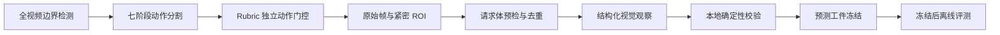

# Resistance Video Action Gating

伏安法测电阻实验视频的七阶段动作分割与 Rubric 独立视觉取证原型。

该项目把“什么时候发生了什么动作”和“某个评分项是否有直接视觉证据”分开处理。七阶段分割只提供检索时间窗，不能直接充当评分证据。证据不足时系统自动弃权，`predicted_score=null`，不进入人工补分流程。

> 这是研究原型，不是可直接投入教学评分的完整产品。仓库不包含真实学生视频、姓名、Excel 标注、专家分数、原始模型响应或历史实验输出。

## 核心流程



七个动作阶段：

| 标识 | 含义 |
|---|---|
| `circuit_wiring` | 电路连接 |
| `measurement_1` | 第一次测量 |
| `recording_1` | 记录第一组数据 |
| `circuit_rewiring` | 电路改接 |
| `measurement_2` | 第二次测量 |
| `recording_2` | 记录第二组数据 |
| `material_cleanup` | 拆除与整理 |

例如，指针类证据应在 `measurement_1/2` 搜索；记录纸证据应在 `recording_1/2` 搜索；整理动作应在 `material_cleanup` 或受控末段扫描中搜索。动作标签本身不证明任何 Rubric 通过或失败。

## 环境

- Python 3.10+
- OpenCV
- NumPy
- OpenAI-compatible Python client

```powershell
python -m venv .venv
.\.venv\Scripts\Activate.ps1
python -m pip install -r requirements.txt
```

模型连接信息只从环境变量读取。代码没有默认服务地址：

```powershell
$env:QWEN_API_BASE_URL = "<your-openai-compatible-base-url>"
$env:QWEN_API_TOKEN = "<your-token>"
$env:QWEN_MODEL = "<your-model-name>"
```

不要把真实值写入 `.env.example` 或提交到 Git。

## 快速开始

将获得授权且已匿名化的视频放在本地 `data/videos/`。该目录被 Git 忽略。

### 1. 建立全视频时间清单

```powershell
python scripts/filter_redundant_video_frames.py `
  data/videos/sample_001.mp4 `
  --output-dir outputs/marker_filter
```

### 2. 锁定有效实验边界

```powershell
python scripts/qwen_experiment_segment_judge.py `
  --input-dir outputs/marker_filter `
  --output-dir outputs/experiment_boundary `
  --prompt-profile voltmeter_resistance `
  --timestamp-watermark
```

模型只选择匿名帧 ID；时间戳由本地代码映射。请求失败时脚本保存脱敏错误并返回非零退出码。

### 3. 执行七阶段动作分割

主路径按固定分钟独立观察，再在本地合并：

```powershell
python scripts/qwen_experiment_action_minute.py `
  --input-dir outputs/marker_filter `
  --segment-source outputs/experiment_boundary/summary.json `
  --output-dir outputs/action_minutes

python scripts/qwen_experiment_action_minute_merge.py `
  --input-dir outputs/action_minutes
```

`qwen_experiment_action_segment.py` 和 `qwen_experiment_action_stepwise.py` 保留为粗到细、逐阶段两种可替换实现。合并器只接受 `valid=true` 的分钟观察。

### 4. Rubric 独立取证

整理动作证据包：

```powershell
python scripts/build_cleanup_action_guided_v1.py `
  --summary outputs/action_minutes/action_segments_summary.json `
  --source-dir data/videos `
  --output-dir outputs/cleanup_evidence
```

记录阶段的电压表并联拓扑候选包：

```powershell
python scripts/build_voltmeter_parallel_action_guided_v1.py `
  --summary outputs/action_minutes/action_segments_summary.json `
  --source-dir data/videos `
  --output-dir outputs/voltmeter_parallel_evidence
```

每个 builder 只负责检索和构建证据包，不读取标签，也不计算学生分数。

### 5. 模型请求前预检

```powershell
python scripts/preflight_qwen_request.py `
  --manifest outputs/voltmeter_parallel_evidence/sample_001/events/event_01/event_packet_manifest.json `
  --output outputs/preflight/event_01.json
```

默认硬预算为 8 张图、10 MiB JPEG、14 MiB 预计 Base64、单图 2 MiB。预检还检查解码、SHA-256 重复、近重复和近似全幅 ROI。预检失败只代表本次请求不应发送，不能写成学生不合格。

### 6. 执行一次结构化视觉观察

通用观察入口不读取标签，也不输出分数或最终 Rubric 决策：

```powershell
python scripts/run_qwen_structured_observation.py `
  --manifest outputs/voltmeter_parallel_evidence/sample_001/events/event_01/event_packet_manifest.json `
  --rubric-config configs/rubrics/structured_observation.example.json `
  --output outputs/observations/event_01.json
```

它会在请求前强制运行同一套媒体预检，每次命令最多发送一次请求。预检失败、请求失败或返回 JSON 未通过本地校验时，观察状态保持弃权，不会生成学生分数。

### 7. 冻结预测工件

```powershell
python scripts/freeze_artifact.py `
  --input outputs/predictions/prediction_manifest.json `
  --output outputs/predictions/prediction_manifest.freeze.json
```

只有冻结并记录 SHA-256 后，才能在项目外部读取标签进行离线比较。留出集标签不得进入检索、提示词或规则调整。

## 自动弃权

证据缺失、遮挡、不可读、时序不完整或本地校验失败时，评分层应输出：

```json
{
  "automated_outcome": "abstained",
  "predicted_score": null,
  "abstention_reason": "evidence_insufficient"
}
```

强制把证据不足样本改成 `pass` 或 `fail` 会混淆“没有看到”和“看到了错误”。

## 测试

```powershell
python -m compileall -q scripts tests
python -m unittest discover -s tests -v
```

测试不读取视频、不调用网络，也不需要 Qwen 凭据。

## 仓库边界

公开仓库只包含通用代码、配置、文档和匿名 JSON 示例。数据治理要求见 [docs/privacy.md](docs/privacy.md)，架构与工件关系见 [docs/architecture.md](docs/architecture.md)。

## License

[MIT](LICENSE)
