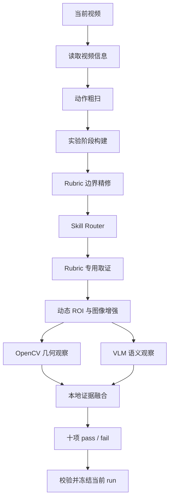
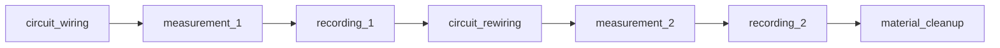
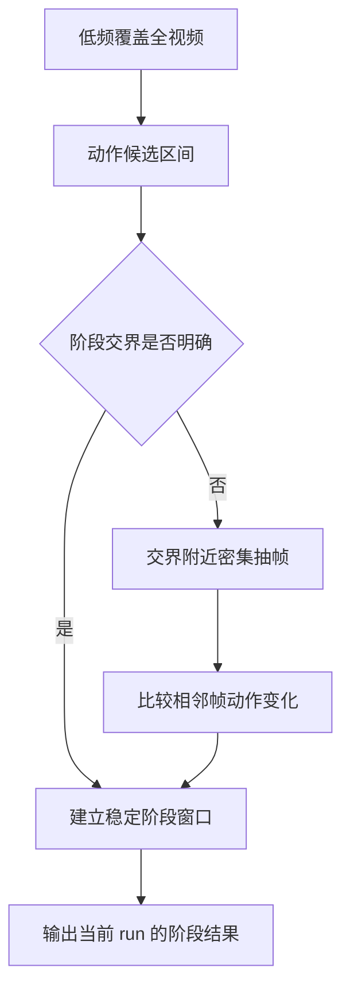
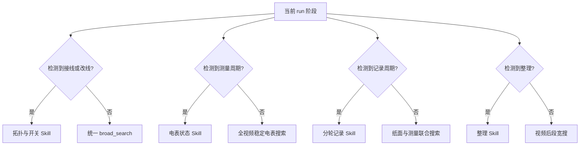
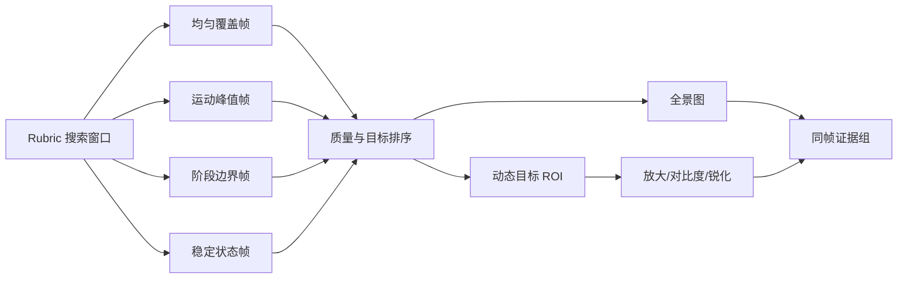
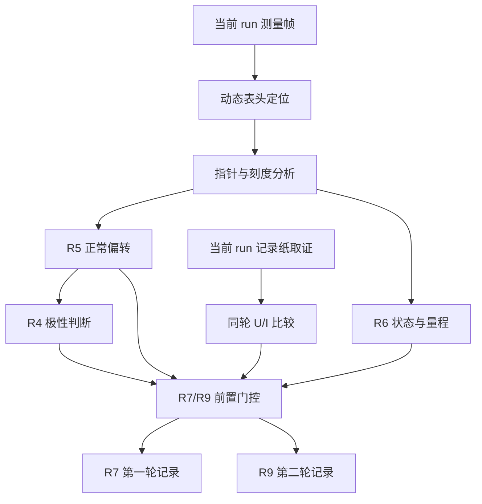
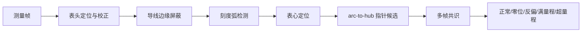
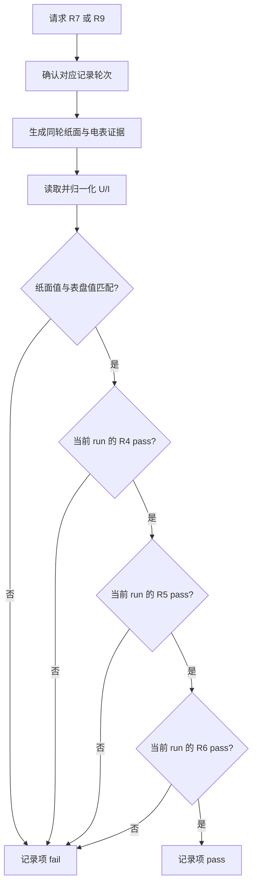
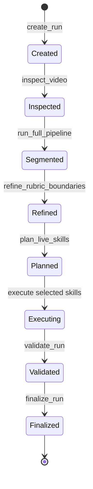
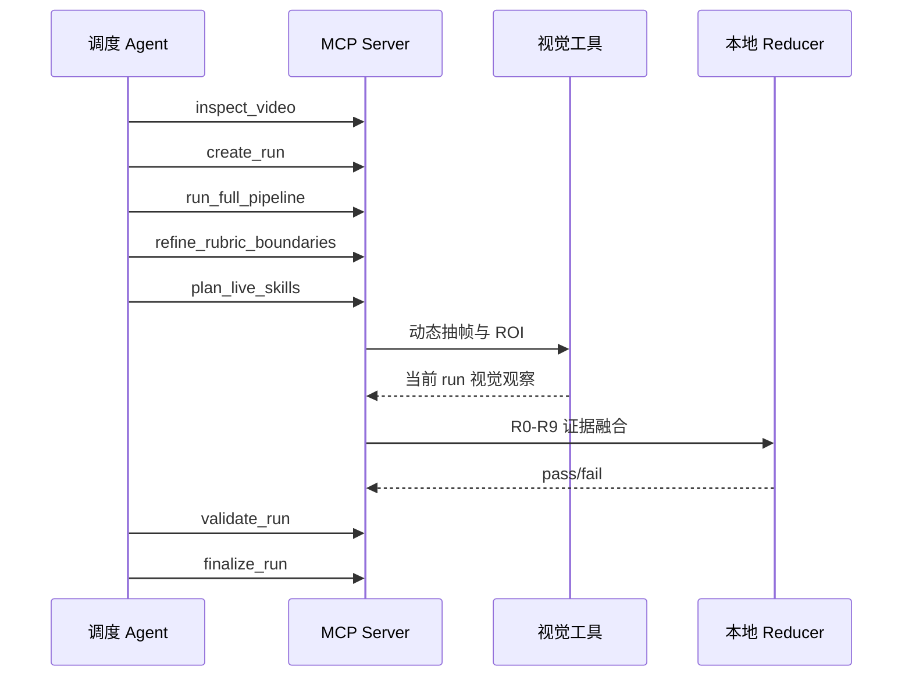

# 伏安法视频理解 Agent

这是一个面向中学“伏安法测电阻”实验视频的视觉评分 Agent。系统不会把整段视频一次性交给模型直接猜分，而是先理解当前视频中的实验阶段，再为每个评分项选择对应 Skill，动态寻找证据，最后用本地规则输出十项二分类结果。

Agent 的正式评分范围为 `R0-R9`。每项主结果只能是 `pass` 或 `fail`；置信度、遮挡、冲突、候选帧和模型原始观察保留在诊断信息中，不会产生第三类评分。

## 1. 设计目标

Agent 版重点解决四个问题：

1. **视频节奏不同**：每次从当前视频重新定位接线、测量、记录、改线和整理，不套用某个样本的时间窗。
2. **设备位置会变化**：从当前帧动态寻找电流表、电压表、开关、电池、端子和记录纸，不使用按视频编号保存的固定 ROI。
3. **单帧经常不清楚**：先粗扫，再在阶段边界和高价值窗口密集抽取相邻帧，用动作前后变化补足单帧证据。
4. **多个评分项需要相同画面**：同一次取证可以被多个 Rubric 消费，减少重复解码、抽帧和模型请求。

系统复用成熟的阶段定位和视觉能力，并增加情境驱动的 Skill Router、自适应取证、动态 ROI、多帧融合、确定性二分类 reducer 和 MCP 工具入口。

## 2. 总体流程



流程分成三个层次：阶段层回答“动作大约发生在什么时候”，Skill 层回答“当前评分项应该看什么”，Reducer 层回答“可见事实如何稳定地归并为 pass 或 fail”。模型负责描述画面中直接可见的事实，本地程序负责时间绑定、数值计算、冲突处理和最终评分。

## 3. 当前视频阶段识别

Agent 先从全视频识别四类基础动作：

- `wiring_action`：插拔导线、调整端子、连接器材；
- `measurement_action`：闭合电路、观察电表、稳定测量；
- `writing_action`：在记录纸上书写或核对数据；
- `cleanup_action`：收拢导线、移动器材、整理归位。

随后根据动作顺序和直接可见证据形成七阶段：



这不是强制模板。学生可能先记录后补看电表，也可能测量和书写连续发生。Agent 会保留真实检测到的子区间，不会为了凑齐七阶段而伪造动作。阶段缺失时，对应 Skill 使用统一 `broad_search`，从当前视频重新搜索。

### 粗扫与边界精修



粗扫用于控制成本，边界精修用于捕获短暂插拔、开关变化、指针偏转和书写动作。后续 Rubric 只把阶段作为搜索范围，不会把阶段名称直接当成评分答案。

## 4. 情境驱动的 Skill Router

Skill Router 只读取当前 run 已观察到的阶段和证据情况。视频 ID、文件名和学生姓名只用于关联输入输出，不参与算法选择。



每次规划都会保存审计结果：

```json
{
  "selection_basis": "current_video_observed_situation_only",
  "observed_stages": [],
  "selected_skills": [],
  "video_id_used_for_routing": false,
  "historical_artifacts_used": false,
  "fixed_video_roi_used": false
}
```

相同视觉情况必须选择相同 Skill 和参数。正式 `execute` 不读取以前保存的时间窗、ROI、预测、人工复核或 Excel 分数。

## 5. 自适应抽帧与动态 ROI

每个 Rubric 有不同的证据需求，因此不会强行使用同一组帧：



OpenCV 负责运动、清晰度、轮廓、颜色区域、特征匹配、几何关系和候选排序；VLM 负责辨认器材、动作语义、端点关系、表盘状态和纸面数字。定位失败时保留全景继续判断，不把“没有定位到 ROI”直接解释成学生操作错误。

所有发送给模型的图像都带有 `image_group` 和 `frame_id`。全景图、局部图和增强图只有来自同一个真实帧时才能组成同帧证据，避免把不同时间的两根导线或两个读数错误拼接在一起。

## 6. 一次取证，多项消费

多个 Rubric 可以读取同一 run 已生成的原帧、ROI 和结构化观察，但不能读取以前运行的最终预测。



这种复用减少重复抽帧和模型请求，同时通过当前 run 边界保持证据隔离。

## 7. 十项 Rubric 算法

| Rubric | 评分目标 | 主要阶段 | 核心证据 |
|---|---|---|---|
| R0 | 实验后整理归位 | 整理、视频后段 | 器材收拢动作及前后状态变化 |
| R1 | 电流表串联 | 接线、改线、稳定测量 | 电流表两端与主回路拓扑 |
| R2 | 电压表并联 | 测量、记录 | 电压表两线是否到达电阻不同端点 |
| R3 | 接线时开关断开 | 接线、改线 | 接线动作与开关闭合是否同帧重叠 |
| R4 | 正负接线柱正确 | 通电测量 | 电表指针正向或反向偏转 |
| R5 | 指针正常偏转 | 稳定测量 | 零位、反偏、正常、满量程、超量程 |
| R6 | 电表量程合适 | 稳定测量 | 刻度、指针比例、量程端子与稳定状态 |
| R7 | 第一组记录正确 | 第一轮测量与记录 | 同轮纸面 U/I、双表读数及电表有效性 |
| R8 | 换电池前断开开关 | 改线 | 开关、端子换接和前后电池拓扑时序 |
| R9 | 第二组记录正确 | 第二轮测量与记录 | 同轮纸面 U/I、双表读数及电表有效性 |

### R0：整理归位

R0 优先检查 `material_cleanup`，在动作前、动作中和动作后保存全景证据。OpenCV 寻找视频后段的运动峰值和器材位置变化，VLM 判断学生是否真正收拢导线、移动器材或完成归位。

- `pass`：存在明确整理动作，并形成稳定的收拢或归位状态。
- `fail`：只有实验结束、人员离开或画面静止，没有可见整理动作。

### R1：电流表串联

R1 同时观察接线过程和接线完成后的稳定状态。转场高频抽帧用于捕捉端子插拔，稳定帧用于检查最终拓扑。动态 ROI 围绕电流表面板、端子和相邻导线生成。

本地 reducer 依次检查直接跨接电源、稳定期主回路、双端同节点、必要端子悬空和相邻帧拓扑一致性。接线中的短暂悬空不会自动判错；明确危险拓扑或稳定期非串联会判为 `fail`。

### R2：电压表并联

R2 先把同轮测量和记录合并为观察周期，再在原始分辨率帧中动态寻找电压表、电阻和二者联合区域。它关注端点关系，而不是“画面中出现了电压表”。

- `pass`：同帧或严格相邻证据显示两根电压表导线分别到达电阻的两个不同端点。
- `fail`：两线接在同一端、接到错误器件、形成非并联关系，或必要端点明确悬空。

不同时间的两根导线不能被任意拼成一次正确并联。

### R3：接线时开关断开

R3 在接线和改线窗口中密集扫描刀闸状态、端子占用变化和插头运动。核心不是单独看“开关是否闭合”，而是判断接线动作与持续闭合是否在同一帧或同一连续支持段重叠。

```text
fail = wiring_active AND persistent_closed
```

全画面平移不能当成插头运动；只看到闭合开关但没有同时发生接线动作，也不能构成该项失败。

### R4：正负接线柱正确

R4 直接复用当前 run 的表针取证。算法不根据导线颜色、画面左右或设备外壳颜色猜测正负极。正常正向偏转支持 `pass`，明确反向偏转支持 `fail`；零位、超量程或未通电会保留真实原因，不会伪装成“看到反接”。

### R5：指针正常偏转

R5 在测量阶段定位表头，通过特征匹配和单应性校正把倾斜表盘归一化。随后屏蔽可能被误认为指针的导线边缘，用刻度弧到表心的几何关系寻找真实指针。



多帧中位数和离群值过滤用于抑制反光、刻度线和文字笔画造成的假指针。最终输出 R5 的 `pass/fail`。

### R6：电表状态与量程

R6 与 R5 共用表头和指针计算，但进一步结合印刷刻度、指针比例、量程上限和稳定性判断当前量程是否合适。表盘按有效小格换算读数，比例小于零用于识别反偏，大于满量程用于识别超量程。

- `pass`：指针稳定处于可读范围，量程证据合适。
- `fail`：明确反偏、超量程、偏转过小、量程过大或量程过小。

### R7：第一组记录正确

R7 绑定第一轮 `measurement_1` 与 `recording_1`。Agent 动态定位记录纸、电流表和电压表，读取同一轮的纸面 U/I 与电表读数，完成量纲和容差归一化后比较。

```text
R7 = 第一轮纸面与表盘读数匹配
     AND R4 正负接线柱正确
     AND R5 指针正常偏转
     AND R6 电表量程合适
```

### R8：换电池前断开开关

R8 把每次换接视为独立 episode，分别检查换接前稳定状态、直接端子操作、换接后稳定状态和开关时序。动态电池 ROI 从当前全景中定位，再跟踪相邻帧。


不同 episode 的开关证据和端子证据不能拼接。只有完整满足顺序的 episode 才能通过。

### R9：第二组记录正确

R9 使用第二轮 `measurement_2` 与 `recording_2`，算法与 R7 相同，但证据必须属于第二轮。第一轮纸面数字、第一轮表盘读数和第二轮读数不能跨轮融合。

```text
R9 = 第二轮纸面与表盘读数匹配
     AND R4 正负接线柱正确
     AND R5 指针正常偏转
     AND R6 电表量程合适
```

## 8. R7/R9 完整门控流程



当只请求 R7/R9 时，Bundle 会自动补齐依赖，生产顺序固定为：

```text
R5/R6 表头取证 -> R4 极性 -> R7/R9 分轮记录
```

门控只读取当前 run 已生成的二分类结果。任何明确的 R4、R5 或 R6 `fail` 都会强制记录项 `fail`；低置信度只进入诊断，不改变二分类接口。

## 9. OpenCV、VLM 与本地 reducer 的分工

| 组件 | 负责内容 | 不负责内容 |
|---|---|---|
| OpenCV | 运动、清晰度、轮廓、特征、ROI、几何、指针和刻度 | 不根据实验常识直接打分 |
| VLM | 器材语义、动作、端点关系、表盘和纸面可见内容 | 不读取真值，不决定最终分数 |
| 本地 reducer | 时间绑定、数值换算、冲突规则、前置门控、pass/fail | 不重新发明画面事实 |

当 OpenCV 与 VLM 冲突时，系统保存双方原始观察，再按 Rubric 预先定义的优先级处理。明确反偏、超量程、同帧闭合接线等强失败证据不会被一个弱 `pass` 覆盖。

## 10. Agent 状态机



`prepare` 模式运行到规划和输入检查；`execute` 模式实际生成证据并完成十项结果。原视频只读，所有帧、ROI、观察和结果都写入独立 run 目录。

## 11. 输出结构

```json
{
  "rubric_id": 7,
  "decision": "pass",
  "predicted_score": 1,
  "confidence": 0.86,
  "reason": "same-cycle values match and meter prerequisites pass",
  "supporting_frame_ids": [],
  "supporting_timestamps_seconds": [],
  "evidence_quality": "medium",
  "diagnostics": {},
  "selection_basis": "current_video_observed_situation_only",
  "video_id_used_for_routing": false,
  "historical_artifacts_used": false,
  "fixed_video_roi_used": false
}
```

`pass` 对应分数 1，`fail` 对应分数 0。R7/R9 还会保存纸面读数、电表读数、轮次绑定、容差计算和 R4/R5/R6 门控明细。

## 12. 安装与运行

```powershell
python -m venv .venv
.\.venv\Scripts\Activate.ps1
python -m pip install -r agent\requirements.txt

python agent\run_agent.py `
  --scheduler deterministic `
  --mode execute `
  --video-ref data\videos\sample.mp4 `
  --run-id sample_execute
```

只进行准备和规划：

```powershell
python agent\run_agent.py `
  --scheduler deterministic `
  --mode prepare `
  --video-ref data\videos\sample.mp4 `
  --run-id sample_prepare
```

启动 MCP stdio 服务：

```powershell
python agent\run_mcp_server.py
```

运行结果写入 `agent/runs/<run-id>/`，不会覆盖原视频或其他 run。模型连接信息通过环境变量配置，仓库内不保存真实地址和凭据。

## 13. MCP 调度

MCP 入口把视频检查、run 创建、阶段定位、边界精修、Skill 规划、Rubric 执行、校验和冻结暴露为工具。



## 14. 防止过拟合

- 不按视频 ID、文件名或学生姓名选择 Skill、时间窗、阈值和结论。
- 不读取过去 run 的预测、人工复核、固定 ROI 或历史最佳工件。
- 阶段缺失时重新 broad search，不加载某个视频以前的阶段答案。
- Excel 和人工真值只允许在预测冻结后离线评测，不发送给视觉模型。
- 相同视觉情况必须采用相同 Skill 和参数。
- 每帧动态定位目标，摄像机变化后重新计算 ROI。
- 一次取证可以被多个 Rubric 消费，但必须来自当前 run。
- 所有 Rubric 最终输出二分类，低证据质量只影响置信度和诊断。

## 15. 测试

```powershell
python -m compileall -q agent
python -m unittest discover -s agent\tests -v
python agent\run_agent.py --help
git diff --check
```

测试覆盖 Skill 路由、动态取证、R0-R9 二分类、R7/R9 前置门控、当前 run 隔离、无视频 ID 路由、无固定 ROI 和发布边界。

更深入的技术细节见 [Agent Rubric 算法手册](./docs/algorithms/README.md)，调度约束见 [反过拟合调度提示词](./prompts/tool_scheduler_anti_overfitting.md)。仓库不包含原始视频、Excel、模型原始响应、运行输出或真实凭据。
