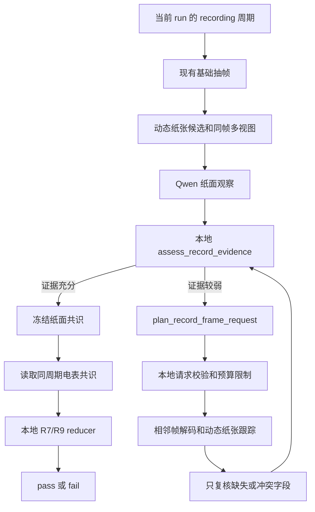

# R7/R9 记录纸自适应抽帧 Agent 设计 v1

## 1. 状态与目标

本文同时记录设计和 v1 实施状态。当前 `execute` 已接通受控补帧、动态纸面候选、R7/R9 成组失效重算和确定性调度闭环。

目标是在现有 R7/R9 周期绑定流程上增加一个受控的记录纸取证 Agent。当首轮图片因为模糊、书写遮挡、纸张移动、字段缺失或多帧数字冲突而不足时，Agent 可以申请当前视频的相邻帧，重新执行动态纸张定位和字段观察。

该 Agent 只负责补充视觉证据，不直接修改评分。R7/R9 最终仍由本地 reducer 输出 `pass` 或 `fail`。

第一版主要解决已经检测到的 `recording_1` 和 `recording_2` 中的记录纸可读性，同时补齐阶段缺失时统一的当前 run `broad_search`。它不同时重写仪表读数或 Rubric 定义。实验结果不理想时，使用新版本迭代参数和策略，不为视频编号增加特殊分支。

## 2. 当前基线

当前实现位于 `resistance_agent/record_rubrics.py`，主要流程为：

```text
当前 run 的 recording_1 / recording_2
-> 记录结束附近的固定候选时间点
-> 当前帧白色纸张候选和搜索视图
-> 全景、彩色增强、高对比度墨迹图组成 image_group
-> Qwen 读取 U1/I1 或 U2/I2
-> 多帧数字共识
-> 必要时进行数字笔画复核
-> 与同周期电表读数比较
-> R7/R9 pass/fail
```

当前正式 `toolkit.run_record_rubrics()` 已经强制：

```text
allow_historical_fallback=false
```

因此正式 live 调用不使用按视频编号登记的固定 ROI 或历史时间窗。`record_rubrics.py` 的发布版已经删除电表、表盘、纸面和字段的按视频固定 ROI 表，当前帧动态候选是唯一定位路径。

## 3. 当前问题

### 3.1 固定候选点可能错过清晰瞬间

当前纸面候选主要围绕记录结束时间的若干固定偏移。学生可能仍在书写、手掌刚好遮挡字段，或者纸张只在两个候选点之间短暂抬起。

### 3.2 多种视图不等于多帧证据

同一原始帧的全景、彩色增强图和墨迹增强图必须保持同一个 `image_group`，只能算一票。需要真正增加可信度时，必须取得不同的 `frame_id`。

### 3.3 纸面复核不能被电表答案引导

当前代码可以在纸面和电表不匹配时启动数字笔画复核。新 Agent 不得因为“不匹配”本身寻找另一个更接近电表的纸面数字。

正确顺序必须是：

```text
先根据纸面自身质量冻结纸面数字
-> 再读取同周期电表数字
-> 最后比较两者
```

只有纸面自身出现字段缺失、低置信度、遮挡或多帧冲突时，才允许申请纸面补帧。

### 3.4 单帧支持过弱

当前 `digit_consensus_min_support` 默认值为 1。单帧可以形成候选，但如果 Agent 有预算且当前字段只有一帧支持，应先申请邻帧确认。补帧结束后仍只有一帧时，保留该候选并降低置信度，最终仍按统一二分类规则完成评分。

### 3.5 当前 live 使用动态字段 ROI 复核数字笔画

`paper_field_view` 和 `ink_roi_path` 由当前帧的动态纸张候选生成。字段缺失或数字冲突时，二次笔画复核继续使用同一当前帧派生的动态字段 ROI，不读取开发视频固定坐标。

### 3.6 `record.broad_cycle_search` 尚未真正建立宽搜窗口

Router 在没有 `recording_*` 时会选择 `record.broad_cycle_search`，但当前 `cycle_windows()` 只从明确的 `recording_1/2` 建窗，运行函数也没有为 `broad_cycle_search` 生成新的周期窗口。因此漏分段时仍会直接进入缺失阶段的二分类兜底。

新设计需要从当前 run 的 `writing_action`、测量后窗口和实验边界构造统一宽搜候选。它不能读取旧 Temporal Guard 时间窗。

### 3.7 历史开发集结果不代表当前 live 路径

历史 R7/R9 v14 在五个开发视频的可比较标签上得到过 `9/9`，但冻结工件包含 `paper_calibrated_rois`。该结果只能说明带开发集标定的历史回归，不能证明 `allow_video_calibration=false` 的动态 live 准确率。新 Agent 必须单独建立 Baseline 和 Treatment。

## 4. 总体架构



Agent 只生成补帧申请。时间范围、帧数、阶段包含关系、去重、ROI 和运行次数由本地执行器控制。

## 5. 证据质量评估

新增本地函数：

```text
assess_record_evidence(cycle, paper_observation, paper_rows)
```

它对当前周期的两个目标字段分别输出：

```json
{
  "cycle": 1,
  "target_fields": {
    "u1": {
      "status": "read | missing | low_confidence | conflict | occluded",
      "value": 1.5,
      "distinct_frame_support": 1,
      "confidence": 0.63,
      "supporting_frame_ids": ["frame_00001234"]
    },
    "i1": {
      "status": "read",
      "value": 0.22,
      "distinct_frame_support": 2,
      "confidence": 0.82,
      "supporting_frame_ids": ["frame_00001234", "frame_00001240"]
    }
  },
  "request_more_frames": true,
  "request_reasons": ["u1_single_frame_support"]
}
```

允许触发补帧的情况：

- 当前周期没有任何动态纸张候选；
- Qwen 在所有组中都没有确认记录纸；
- 目标字段标签不可见；
- 数字被手或笔遮挡；
- 字段置信度低于 `0.70`；
- 只有一个不同 `frame_id` 支持该数字；
- 两个数字候选具有相同或接近的不同帧支持；
- 第二周期无法区分 U1/I1 与 U2/I2；
- 当前纸张 ROI 的视角或模糊程度使数字笔画不完整。
- `recording_<cycle>` 漏检，但当前 run 中存在 writing 或测量后记录候选。

以下情况不能触发纸面补帧：

- 纸面数字与电表数字不一致，但纸面自身证据清楚；
- 当前预测是 `fail`；
- Excel、人工答案或期望数字与预测不一致；
- `video_id`、文件名、学生姓名或 SHA-256 对应某个历史错误；
- 该视频过去保存过一个更清晰的时间点或 ROI。

Qwen 响应格式错误时先进行一次结构修复重试。格式错误本身不直接申请更多视频帧。

## 6. 补帧申请接口

第一版复用现有 `request_additional_evidence` MCP 工具和运行状态，不新增功能重复的工具名。工具内部增加 `record_paper` profile，由本地 dispatcher 选择电表或记录纸执行器。

Agent 申请结构：

```json
{
  "rubric_ids": [7],
  "evidence_profile": "record_paper",
  "cycle": 1,
  "reason": "digit_conflict",
  "target_fields": ["u1"],
  "anchor_frame_ids": ["frame_00001234", "frame_00001240"],
  "search_mode": "adjacent_dense",
  "interval_seconds": 0.2,
  "max_frames": 16,
  "roi_mode": "dynamic_paper_tracking",
  "view": "paper_fields"
}
```

生产工具根据当前 run 的纸面质量生成包含 `time_ranges` 的模板，调度 Agent 原样提交。执行器再次校验时间范围必须落在当前 `recording_<cycle>`、写后展示区或统一 broad search 区域，并按真实 `frame_number` 去重。

允许值：

| 字段 | 允许值 |
|---|---|
| `rubric_ids` | cycle 1 为 `[7]`，cycle 2 为 `[9]` |
| `reason` | `paper_not_found`、`writing_occlusion`、`field_missing`、`low_confidence`、`single_frame_support`、`digit_conflict`、`row_identity_conflict`、`recording_stage_missing` |
| `search_mode` | `adjacent_dense`、`post_write_reveal`、`recording_stage_coverage`、`current_run_broad_writing_search` |
| `interval_seconds` | `0.1` 到 `0.5` 秒 |
| `roi_mode` | 只能是 `dynamic_paper_tracking` |
| `view` | `paper_full` 或 `paper_fields` |

## 7. 本地预算和停止条件

第一版使用统一预算：

| 限制 | 默认值 |
|---|---:|
| 每个周期最多补帧轮数 | 2 |
| 每轮最多解码帧数 | 20 |
| 每周期最多新增帧数 | 32 |
| 单次搜索范围 | 最多 4 秒 |
| 每周期累计搜索范围 | 最多 6 秒 |
| 每轮发送给 Qwen 的新 image_group | 最多 4 组 |
| 每周期额外 Qwen 请求 | 最多 2 次 |
| 相邻帧最小间隔 | 0.1 秒 |

通常所有补帧必须位于当前 run 的 `recording_<cycle>` 或该记录结束后最多 6 秒的纸面展示区间。若该阶段缺失，`current_run_broad_writing_search` 只能在当前 run 的实验边界内，围绕直接检测到的 writing 候选或测量后候选做统一 `0.5s` 粗搜，仍受每轮 20 帧和两轮预算限制。已有帧按真实 `frame_number` 去重。

满足以下条件时停止：

```text
两个目标字段均有至少 2 个不同 frame_id 支持
AND 每个字段置信度至少 0.70
AND 没有同等支持的数字冲突
```

达到轮数或帧数预算后也必须停止。停止后仍然使用当前最可能证据完成 `pass/fail`，并把 `request_limit_reached`、缺失字段和冲突写入诊断字段。

## 8. 动态纸张 ROI

补帧执行器只使用当前帧生成 ROI：

1. 使用亮度、低饱和度、矩形轮廓和相对面积产生白色纸张候选；
2. 使用局部黑帽文字响应产生文字上下文候选，并用当前帧肤色组件产生书写手部上下文候选；
3. 同时保留最高上下文分和最小有效手部组件，覆盖从画面边缘伸入的局部书写手；
4. 每帧在磁盘中最多保留 4 个动态候选视图用于审计，模型只接收前 2 个候选，通常是最高上下文分和边缘小手部上下文；
5. 不能可靠细化四边形时保留宽 ROI，不把定位失败改写成评分失败；
6. 从动态纸张候选生成字段彩色增强图和墨迹增强图；
7. 所有派生图继承同一个 `frame_id` 和 `image_group_id`，只计一票。

## 8.1 真实视频 smoke 结果

在视频 8 的独立 evaluation 目录中，首轮 Qwen 对 R9 纸面 `U2/I2` 只有一个 `frame_id` 支持，Agent 生成 `single_frame_support` 请求。执行器在 141.7s-143.7s 内申请 11 个候选帧，按真实帧号去重 3 个，新增 8 帧。

重算后：

```json
{
  "u2": {"value": 0.9, "support_frame_count": 2, "confidence": 0.9},
  "i2": {"value": 0.16, "support_frame_count": 2, "confidence": 0.9},
  "adaptive_evidence_recommended": false,
  "video_id_used_for_routing": false,
  "historical_artifacts_used": false,
  "fixed_video_roi_used": false,
  "excel_accessed": false
}
```

纸面补帧只改变 paper fingerprint。meter fingerprint 保持不变，两个 meter Qwen 缓存文件未重写；重算只更新纸面观察，避免同周期电表重复请求。

第一版先复用现有 `_paper_candidates()`、`_enhance()` 和 `_enhance_ink()`，增加动态字段 ROI 与简单相邻帧空间一致性。若实验显示纸张轮廓在遮挡、旋转时频繁丢失，再在 v2 增加 ORB、KLT 或单应性轨迹恢复，避免第一版一次引入过多变量。

清晰度用于当前视频内部排序，不作为单独的 pass/fail 阈值。优先使用当前批次内的相对分位数，避免把某个摄像机的绝对 Laplacian 数值写成全局规则。

建议的候选排序维度：

```text
纸张轮廓可信度
+ 字段区域墨迹密度
+ 当前批次相对清晰度
+ 相邻帧轨迹连续性
+ 标签和目标行可见性
- 手部遮挡比例
- 过曝或强透视惩罚
```

## 9. 多轮证据融合

补帧不是覆盖首轮结果，而是累计当前 run 的直接视觉观察：

- 以 `frame_id` 去重；
- 同一帧多个增强视图仍是一票；
- 只复核申请中的 `target_fields`，已清晰字段不重复请求；
- 一个新帧不能覆盖两个旧帧共同支持的值；
- 新值必须至少得到两个不同帧支持且置信度不低于 `0.70`，才可以替换原来的冲突或缺失状态；
- 纸面共识先冻结，冻结后才允许与电表读数比较；
- 电表数值不得进入纸面提示词或补帧请求理由。

字段冲突的统一排序：

```text
不同 frame_id 支持数
-> 标签与全部数字是否完整可见
-> 平均视觉置信度
-> 完成书写后的较晚清晰帧
```

如果排序后仍完全相同，保留 `conflict` 诊断，并由现有二分类 tie-break 完成评分，不继续无限申请。

## 10. Harness 集成

建议的工具顺序：

```text
run_record_rubrics
-> adaptive_evidence_recommended?
-> request_additional_evidence(evidence_profile=record_paper)
-> 归档旧 R7/R9 工件并使引用失效
-> run_rubric_bundle(rubric_ids=[7,9])
-> validate_run
-> finalize_run
```

`state.json` 增加：

```json
{
  "adaptive_evidence": {
    "record_paper": {
      "cycle_1": {
        "round_count": 1,
        "decoded_frame_count": 16,
        "selected_group_count": 4,
        "target_fields": ["u1"],
        "stop_reason": "two_distinct_frames_agree"
      }
    }
  }
}
```

每次请求保存：

```text
runs/<run_id>/adaptive_evidence/record_paper/cycle_<n>/request_<n>/
├── request.json
├── frames/
├── paper_rois/
├── qwen_observation.json
└── result.json
```

报告必须包含：

```json
{
  "selection_basis": "current_video_observed_situation_only",
  "video_id_used_for_routing": false,
  "historical_artifacts_used": false,
  "fixed_video_roi_used": false,
  "excel_accessed": false,
  "ground_truth_sent_to_model": false
}
```

## 11. 建议修改位置

实施阶段建议按以下边界修改：

| 文件 | 修改内容 |
|---|---|
| `resistance_agent/record_rubrics.py` | 拆出质量评估、补帧合并和纸面先冻结逻辑；live 默认关闭视频专属标定 |
| `resistance_agent/adaptive_evidence.py` | 增加 profile dispatcher 和 R7/R9 请求约束 |
| `resistance_agent/adaptive_record_evidence.py` | 新增动态纸张跟踪、透视校正和相邻帧导出 |
| `resistance_agent/toolkit.py` | 支持 R7/R9 请求、归档旧结果、重新运行 producer |
| `resistance_agent/orchestrator.py` | 在 finalize 前允许最多两轮受控记录纸请求 |
| `resistance_agent/skills/executors.py` | 注册统一预算参数，不登记视频专属配置 |
| `tests/test_adaptive_record_evidence.py` | 请求边界、去重、阶段包含、预算和审计测试 |
| `tests/test_toolkit.py` | R7/R9 失效重跑、纸面冻结和二分类完成测试 |

实现时还必须让 `cycle_mode=broad_cycle_search` 真正产生当前 run 的 writing/测量后宽搜窗口，而不是只增加 `paper_max_samples`。

## 12. 实验方案

### 12.1 基线与实验组

对相同视频生成两个独立 run：

```text
Baseline：当前 live R7/R9，仅使用动态 ROI，不启用补帧
Treatment：相同首轮参数，在纸面质量不足时启用自适应补帧
```

两组使用相同 Qwen 模型、提示词版本和初始候选。运行期间不读取 Excel。

历史带 `paper_calibrated_rois` 的 v14 `9/9` 只作为开发记录，不作为本次 Baseline。

### 12.2 第一阶段开发集实验

先在视频 8、16、24、32、38 上运行，用于开发回归，不报告泛化率：

1. 分别完成 Baseline 和 Treatment；
2. 保存每个字段的首轮观察、申请原因、新增帧和最终共识；
3. 冻结两组 `rubric_7.json`、`rubric_9.json` 和纸面字段预测；
4. 冻结后读取 Excel；
5. 比较准确率、召回率、字段覆盖率和成本；
6. 只有预先定义的通用错误类型可以用于下一版本修改。

### 12.3 指标

| 指标 | 用途 |
|---|---|
| R7/R9 二分类准确率 | 最终效果 |
| pass/fail 召回率 | 防止只提升容易类别 |
| U/I 字段读取覆盖率 | 补帧是否真正找到可读纸面 |
| 两帧一致支持率 | 数字共识质量 |
| 数字冲突解决率 | 自适应帧是否减少冲突 |
| 错误改写率 | Agent 是否把原本正确字段改错 |
| 平均新增帧数 | 计算成本 |
| 平均新增 Qwen 请求数 | API 成本 |
| 平均运行时间 | 工程成本 |
| 触发原因和停止原因分布 | 后续迭代依据 |

### 12.4 第一版完成标准

- 正式 live 路径没有视频 ID 路由、历史工件或固定 ROI；
- 所有补帧都绑定当前 run 的阶段和真实 `frame_id`；
- 清晰且已有两帧共识的字段不触发补帧；
- 动态 live 能生成 `paper_field_view` 和墨迹增强字段视图；
- `record.broad_cycle_search` 在阶段缺失时使用当前 run 候选实际建窗；
- 纸面和电表不匹配不能单独触发补帧；
- 每个周期不超过 32 个新增帧和 2 次额外 Qwen 请求；
- 请求用尽后仍生成 R7/R9 二分类结果；
- 五视频开发集至少解决一个真实的缺失或冲突字段，且不改错原有清晰字段；
- 冻结后新视频才能用于报告泛化准确率。

## 13. 实施顺序

1. 先写请求校验、预算、阶段包含和视频身份无关测试；
2. 实现动态纸张跟踪和同帧多视图导出；
3. 实现纸面自身质量评估，不接入电表值；
4. 接入 `request_additional_evidence` 的 `record_paper` profile；
5. 实现当前 run 多轮累计和 R7/R9 工件失效重跑；
6. 用一个视频做无 Excel smoke test；
7. 跑五视频 Baseline/Treatment 并冻结；
8. 冻结后读取 Excel，按预定义指标比较；
9. 根据错误类型决定是否发布 v2。

第一版不承诺提高准确率。它首先验证三件事：Agent 是否只在确实看不清时申请、申请是否能找到更清楚的不同帧、补帧是否在可控成本内改善纸面数字共识。
